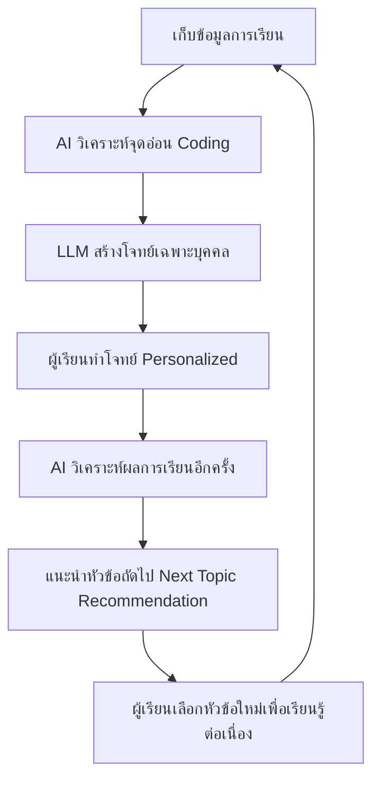

```mermaid
graph TD;
A[เก็บข้อมูลการเรียน] --> B[AI วิเคราะห์จุดอ่อน Coding];
B --> C[LLM สร้างโจทย์เฉพาะบุคคล];
C --> D[ผู้เรียนทำโจทย์ Personalized];
D --> E[AI วิเคราะห์ผลการเรียนอีกครั้ง];
E --> F[แนะนำหัวข้อถัดไป Next Topic Recommendation];
F --> G[ผู้เรียนเลือกหัวข้อใหม่เพื่อเรียนรู้ต่อเนื่อง];
G --> A
```